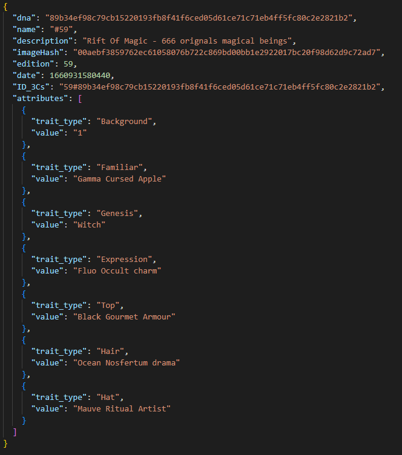

# ⛓ Cross-Chain-Claim

### The 3Cs technology

While the first season is minted on the _Solana blockchain_, we are currently developing a new feature called 3Cs “**Cross-Chain-Claim**”.&#x20;

The principle is quite simple: we started from the realization that buying an NFT on a specific blockchain, say _Ethereum_, does not guarantee its ownership in another one, say _Solana_. Moreover, the number of blockchains already well established today is high, making it costly and difficult to get your NFT in all of them!

Add to this that the Crypto and NFT population is not that large, we are divided!&#x20;

The 3Cs feature allows all Rifters to Buy their NFT once and have the ability to **claim it** on the blockchain of their choice.  By minting a NFT on a specific Blockchain, one can, through our coming soon Web App, claim the **same** NFT on the desired blockchain. All they will have to do is to pay for the minting fees that are blockchain specific.&#x20;

### How does  it work?

Firstly, all the NFTs collections will be minted in the major blockchains named _Solana_, _Ethereum_ and _Polygon, as_ for the first iteration of the app. But it only needs to be minted once!

<figure><figcaption>
Mint once claim everywhere
</figcaption></figure>

As Rift Of Magic is a community driven project, the Rifters decide in what blockchain the next mint should occur. When the blockchain is decided and the mint is live, the community can get their NFTs and go claim them in the other blockchains. &#x20;

When generating our collections, an image is created along multiple metadata, one for each blockchain platform.

Each metadata of the corresponding NFT holds a unique identifier “ID\_3Cs”.&#x20;

<figure><figcaption></figcaption></figure>

This ID is unique and shared among the metadata of the different Blockchain.&#x20;

After logging in with your portfolio, the Web App detects your Rift Of Magic NFTs, checks its metadata and reads the ID.&#x20;

By claiming the NFT in another Blockchain, say Ethereum, the Web App fires a request to read the data from the corresponding collections and check if the NFTs with the equivalent “ID\_3Cs”.&#x20;

If the NFT has not been claimed yet, the user can pay the fees and get it.&#x20;

Note that user can choose not to claim the NFTs on the different blockchain. Furthermore, once minted on a chain, the corresponding NFT that lives on another chain can only be claimed by the **Latest Owner.** This will ensure protection on the ownership of the NFT that lives on the other blockchains.

### Vision

The Vision behind this feature is to protect the ownership of the user and promote unity among the crypto market. The 3Cs feature is of course not the perfect solution to assemble all the NFT lovers, but we believe that it is a step forward for interoperability and trust. &#x20;
