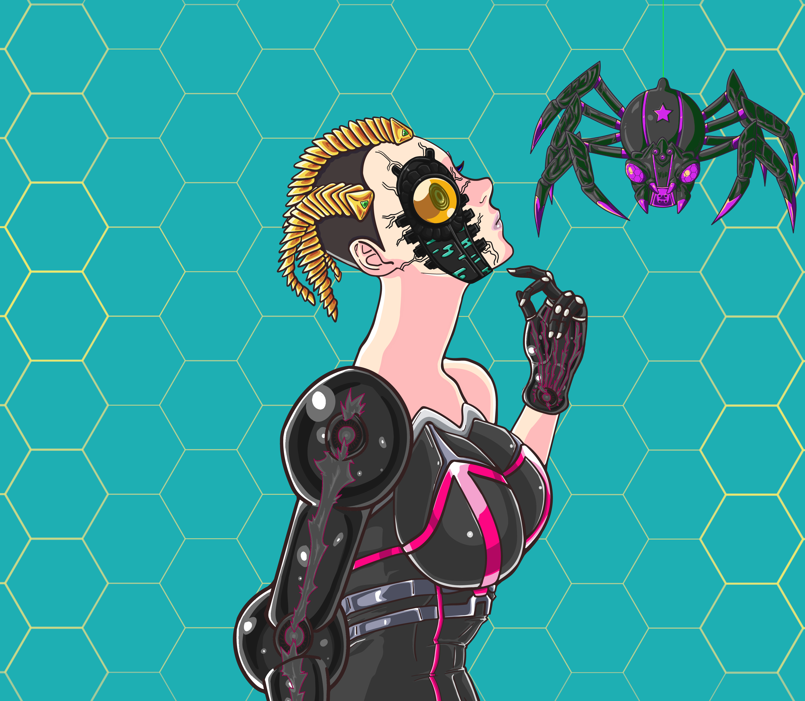
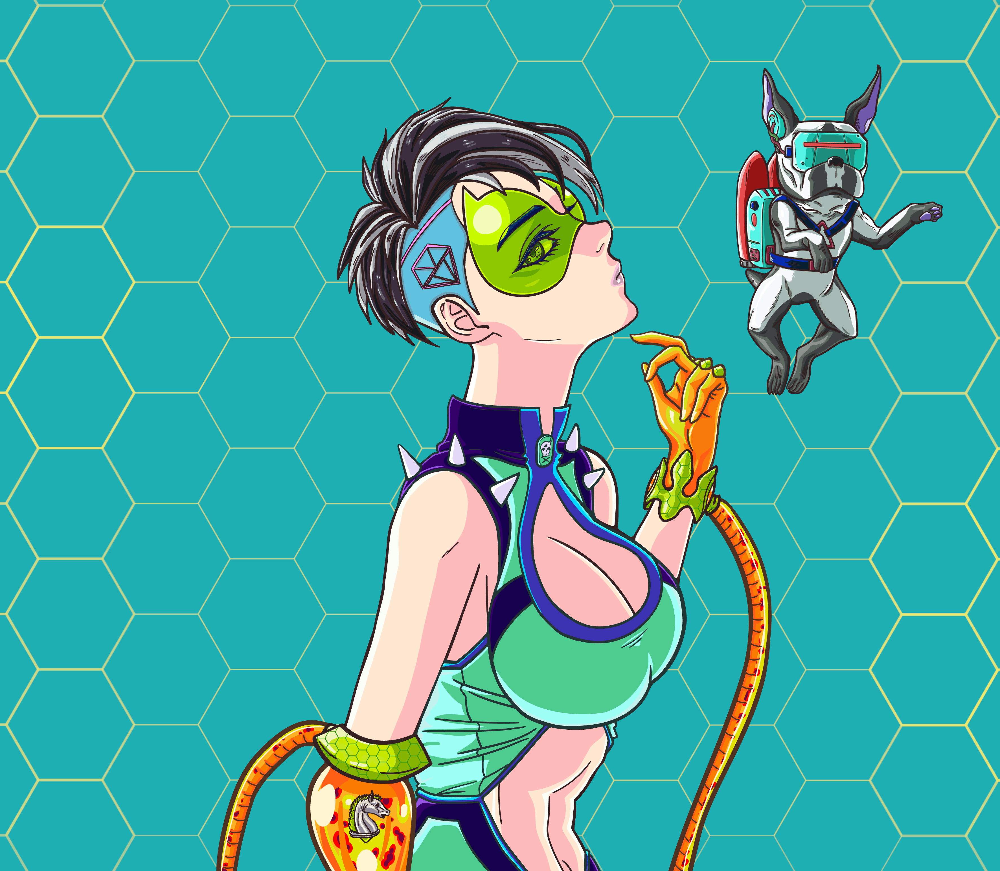
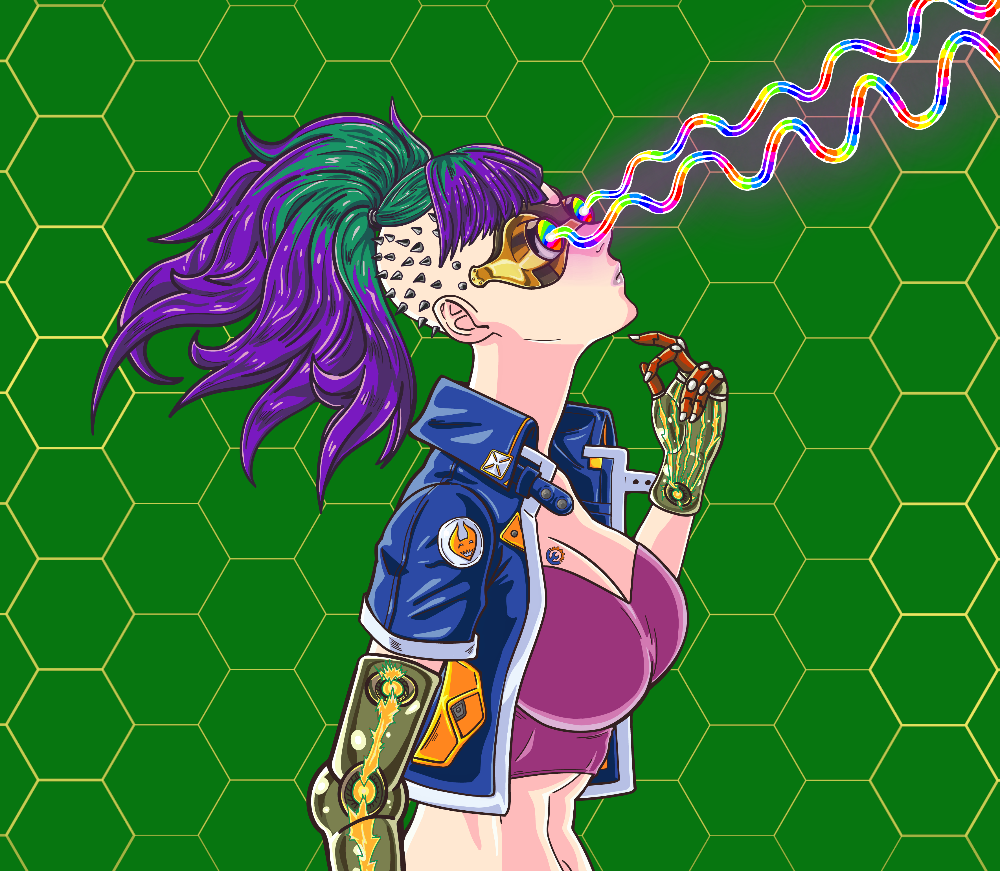

# 👩🎤 Rift Punks

### Lore

Punks are another race of the RiftVerse.

Unlike the witches, they don’t get on well with nature, however they have gathered a vast amount of knowledge.

Real masterminds, they have mastered and tamed the power of the rift.

Passionate about science, punks used the power of Rift Crystals to create unimaginable technologies.

This strong blend of magic and science make the punks a fearsome race, disposing of terrifying weapons and vehicles.

<figure><figcaption></figcaption></figure>

### 1:1

Queen G4L4T3A, mistress of the Punks, unique animated NFT.&#x20;

<figure><figcaption>
Queen G4L4T3A | Rift Of Magic
</figcaption></figure>

### Traits

This collection features more than 100 different traits combined randomly to make unique Punks!

Some traits are very rare and uniquely incorporated to the NFTs.&#x20;

For instance, Rift minions are incorporated in the drawing of 66 over 666 Rift Punks, which make it a rarity of 10%.&#x20;

<figure><figcaption></figcaption></figure>

 

<figure><figcaption></figcaption></figure>

Others are extremely rare, like the laser eyes!

<figure><figcaption></figcaption></figure>

You will be able to check the rarity of your NFTs on our web application.&#x20;
